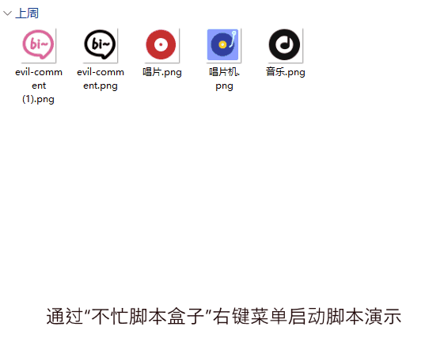

# 图片转ICO

> 将选中图片快速转换为多尺寸 ICO 图标文件

## 1. 简介

右键点击图片即可转换为 Windows 图标文件，自动生成 16/32/48/64/128/256 六个尺寸，完美适配各种显示场景。

- 支持 jpg/png/bmp/gif/tiff 等常见图片格式
- 自动合成 6 种标准图标尺寸，无需手动设置
- 不依赖第三方工具，纯 PowerShell 实现

## 2. 示例

选中图片 → 右键 → 转换为 ICO，同目录生成同名 .ico 文件。一个 .ico 内包含 16/32/48/64/128/256 共 6 种尺寸，Windows 会自动选取合适的大小显示。

## 3. 快速开始

- **自动安装（推荐）**
  
  - 下载 [不忙脚本盒子](https://www.bm-box.cn) 后，打开 → 脚本市场 → 搜索「图片转ICO」→ 点击安装。
  - 盒子会自动配置环境，安装后选中图片右键即可使用。

- **手动安装**
  
  - Windows 自带 PowerShell 5.1+，无需额外安装环境，在脚本目录执行 `powershell -ExecutionPolicy Bypass -File main.ps1 test_params.json`。

## 4. 启动方式（通过盒子部署）

- **单击启动** — 打开不忙脚本盒子，在已安装脚本列表找到「图片转ICO」，单击即可。
- **右键菜单启动** — 选中图片文件 → 鼠标右键 → 菜单选择「图片转ICO」快速转换。

## 5. 全部功能一览

| 功能    | 说明                                             |
| ----- | ---------------------------------------------- |
| 批量转换  | 支持选中多张图片一次性全部转换                                |
| 多尺寸合成 | 一个 .ico 文件内置 16/32/48/64/128/256 六种尺寸，适配各种显示场景 |
| 格式过滤  | 自动跳过非图片文件，不影响其他操作                              |
| 静默处理  | 无弹窗无打扰，后台完成转换                                  |
| 零依赖   | 纯 .NET System.Drawing 实现，无需安装任何第三方库            |

## 6. 更新日志

- v1.0.0（当前最新版）
  - 首次发布
